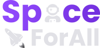
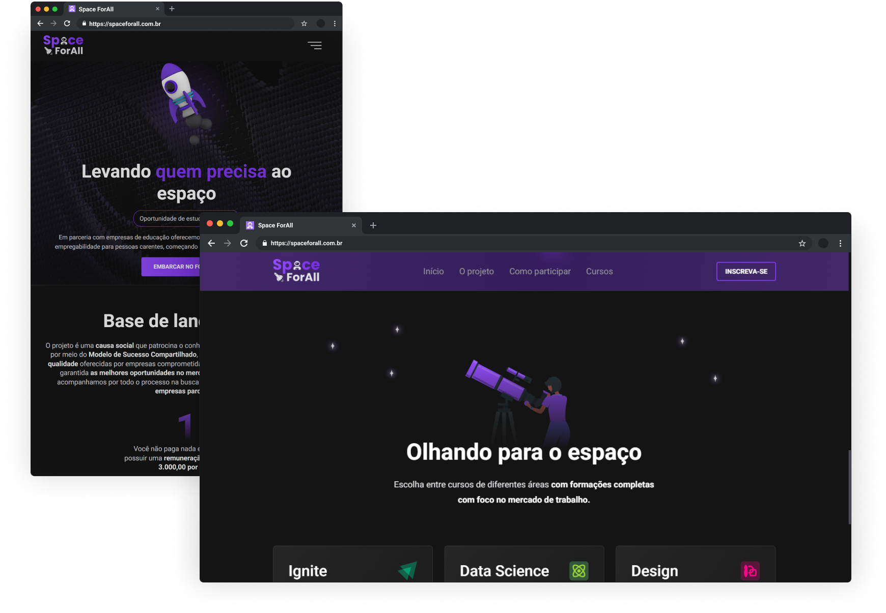

<h1 align="center">
  
</h1>

<p align="center">
  <a href="#-dowhile-challenge">Desafio</a>&nbsp; · &nbsp;
  <a href="#project">Projeto</a>&nbsp; · &nbsp;
  <a href="#-layout">Layout</a>&nbsp; · &nbsp;
  <a href="#-technologies">Tecnologia</a>
</p>

<div>
  
</div>

## Desafio - DoWhile2021

Desafio proposto no evento do [DoWhile](https://dowhile.io/) pelo pessoal da [Rocketseat](https://rocketseat.com.br/) para o programa de bolsas patrocinado pelas empresas parceiras. <br />
O desafio consistia em desenvolver uma aplicação estilo Landing Page, utilizando uma das tecnologias apresentadas e com o tema abaixo: 

```js
"Pensando em construir o futuro, como você solucionaria os problemas de acesso à educação hoje, utilizando a tecnologia?"
```
Para melhor entendimento do desafio em si acesse: [Desafio](https://efficient-sloth-d85.notion.site/Instru-es-dos-desafios-f2f2c5574cf640c59de425413f60c8eb?p=f155a3fc310744b9b57557f7485c8153) <br />

:warning: Um ponto a se destacar é que a ideia deste projeto não foi de minha autoria, dando os créditos ao [Breno Dias](https://github.com/onerBreno), com quem tive a a oportunidade de ajudar na criação do layout, onde cada um desenvolveu essa mesma aplicação utilizando tecnologias diferentes e mudando alguns aspectos visuais.

## :bulb: Uma ideia

<p id="project">
  A idea do projeto é uma plataforma que <strong>patrocina o conhecimento</strong> e evolução de pessoas carentes por meio do <strong>Modelo de Sucesso Compartilhado</strong>, disponibilizando acesso a <strong>formações de qualidade</strong> oferecidas por empresas comprometidas com a educação. 
</p>

## :art: Layout

Utilizamos para criação do layout o [Figma](https://www.figma.com/). Você pode visualizar através [desse link](https://www.figma.com/file/WuMojlB5b02R0qOU1tNObQ/Space-ForAll?node-id=98%3A5). Lembrando que você precisa ter uma conta no Figma para acessá-lo.

## :rocket: Tecnologias

Optei por escolher as tecnologias abaixo para o desenvolvimento do projeto

- [ReactJS](https://pt-br.reactjs.org/)
- [NextJS](https://nextjs.org/)
- [Sass](https://sass-lang.com/)

